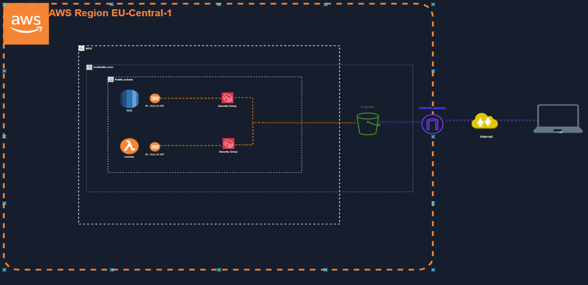
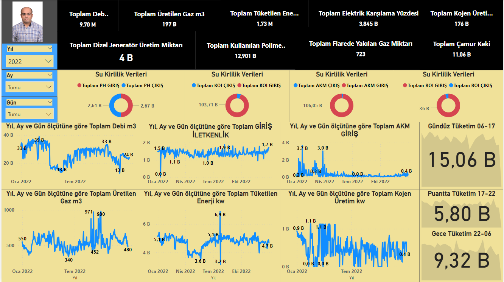
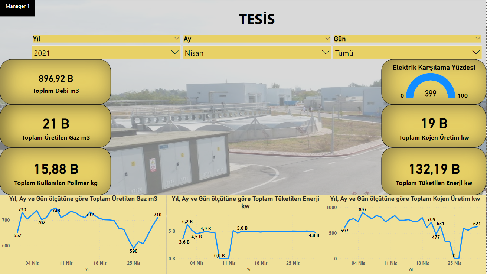
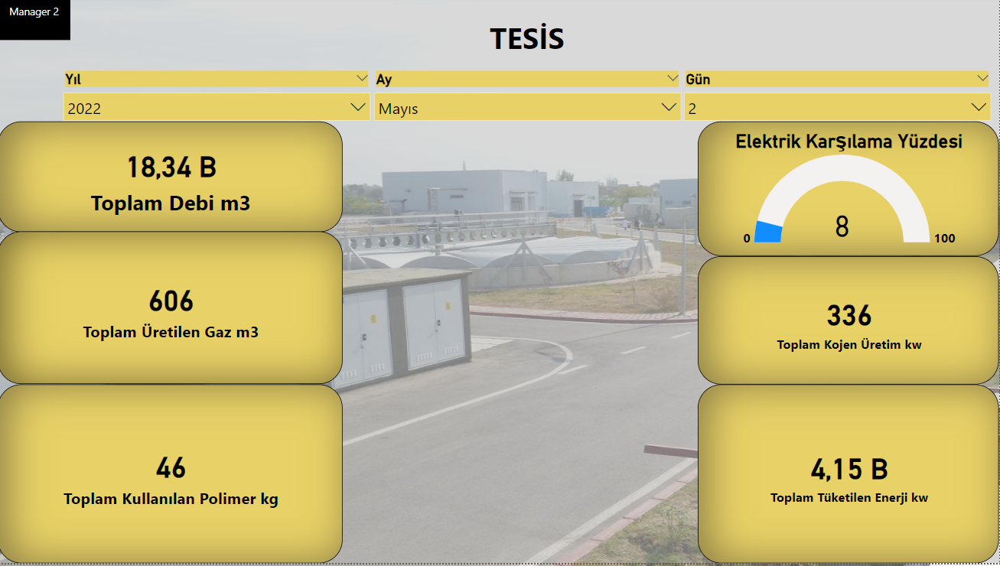
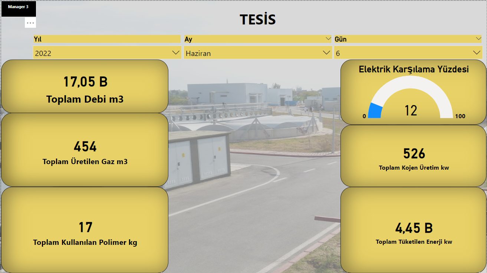

# AWS Cloud Data Analytics and Transfer Pipeline

This repository presents an AWS Cloud-based data analytics and transfer pipeline, designed to automate the entire data journey from the source to the end-point dashboards. It demonstrates a seamless, automated flow of data within an AWS Region (EU-Central-1), facilitating real-time processing and visualization for continuous operation facilities.

## Project Overview

The architecture employs AWS Lambda for compute operations, RDS for database services, and S3 Buckets for data storage and transfer. The final output is presented through tailored dashboards, providing customized views for different management levels.

## Features

- Automated data capture with AWS Lambda functions.
- Data storage and management using AWS RDS and S3 services.
- Customizable, role-based dashboard visualization for data monitoring.

## Architecture

Refer to the AWS architecture diagram in the repository for an overview of the services and data flow:

## Dashboards

The project includes a set of custom dashboards designed for various user roles, showcasing key metrics and data points for efficient management:

- Managerial Dashboard Sample 1: 
- Managerial Dashboard Sample 2: 
- Managerial Dashboard Sample 3: 
- Managerial Dashboard Sample 4: 

## Usage

To deploy this pipeline in your AWS environment:

1. Ensure that you have the necessary AWS services activated.
2. Set up the services as per the architecture diagram.
3. Refer to the [writeS3v3.py]([writeS3v3.pyy](https://github.com/mmehmetisik/AWS-Cloud-Data-Analytics-and-Transfer-Pipeline/blob/23f21d92bd4a3c84d127548d6faec61b62990c20/writeS3v3.py))
 script as an example for pushing data to S3 Buckets.

## Acknowledgments

I'd like to extend my gratitude to my colleagues Nurşah Söğüt and Damla Peker for their valuable contributions to this project. Special thanks to Sinan for his guidance and insights that were critical to the success of this project.

## License

This project is licensed under the MIT License - see the [LICENSE](LICENSE) file for details.
